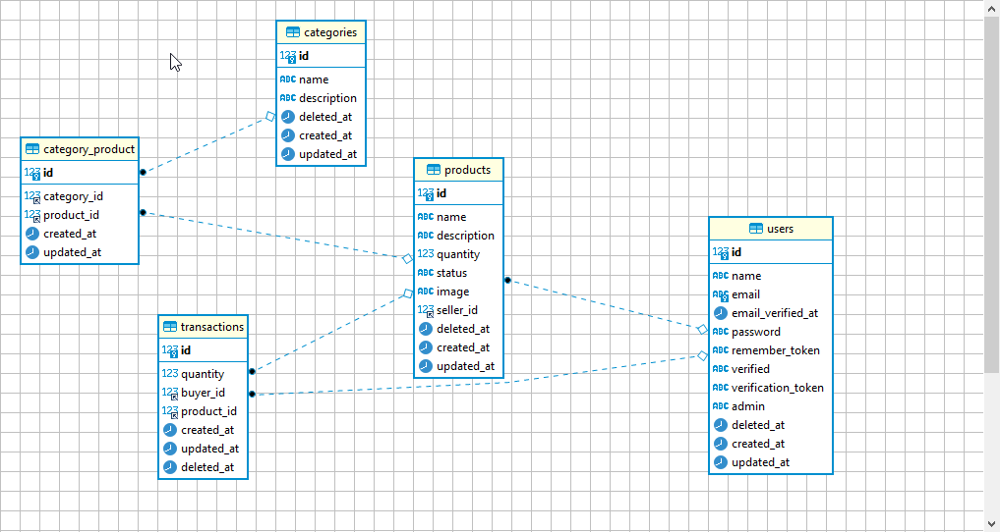

# E-commerce restfull APIs ![version-badge]

This repo for a Laravel (version 7.24) E-commerce restfull APIs.

The user in the system can be buyer or seller or both.

The prouduct in the system belong to a seller and can have multiple categries. And as normal you can find multiple products have the same category.

The transaction in the system belong to a buyer and specific product.



## Requirements
- HTTP Server. For example: Apache
- PHP 7
- MySQL
- Composer

Laragon will take care of that. you can download the full edition from [here](https://laragon.org/download/).

## Getting Started
1. Clone the repo to your device to a folder in C:\laragon\www
2. Create new database with restfull name.
3. Create your .env file and past its content from .env.example then update the info related to connection with the database
    ```
      DB_CONNECTION=mysql
      DB_HOST=127.0.0.1
      DB_PORT=3306
      DB_DATABASE=restfull
      DB_USERNAME=root
      DB_PASSWORD=
    ```
 4. To include the vendor folder just run the below command after cd into the Laravel project's directory.
    ```
      composer install
    ``` 
 5. run the command below to create the required tables
    ```
      php artisan migrate
    ```     
 5. Open Laragon and click start all to run Apache and MySQL. Run the project by click Menu-> www -> your project name or run the command below.
    ```
      php artisan serve
    ```
 6. Open postman and import the collection of the endpoints. you can download it from [here](https://github.com/RaghadSalameh/E-commerceLaravelRestFullAPIs/blob/main/E-commerce%20restfull%20API%20Laravel.postman_collection.json)

 Have fun :) 


 [version-badge]: https://img.shields.io/badge/version-1.0-blue.svg


